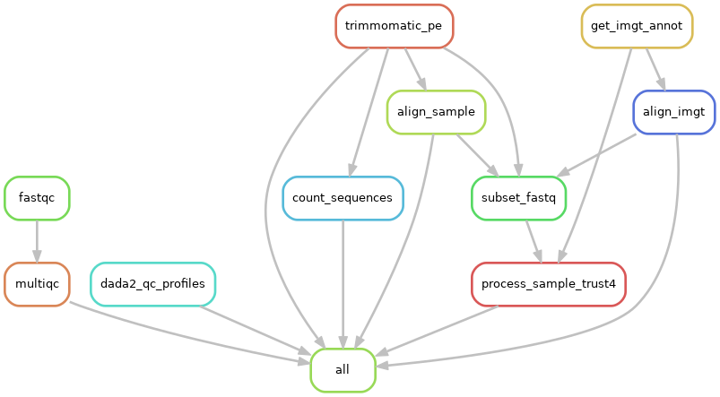

# SATCR pipeline

[Snakemake](https://snakemake.readthedocs.io/en/stable/) pipeline for assembling TCR data, and perform a saturation analysis.

# Pipeline

## References

- [Song L, Cohen D, Ouyang Z, Cao Y, Hu X, Liu XS. _"TRUST4: immune repertoire reconstruction from bulk and single-cell RNA-seq data_". Nature Methods (2021)](https://www.nature.com/articles/s41592-021-01142-2)

- [Bolotin DA, Poslavsky S, Mitrophanov I, Shugay M, Mamedov IZ, Putintseva EV, Chudakov DM. _"MiXCR: software for comprehensive adaptive immunity profiling_". Nature methods (2015)](https://www.nature.com/articles/nmeth.3364)

- [Bolotin DA, Poslavsky S, Davydov AN, Frenkel FE, Fanchi L, Zolotareva OI, Hemmers S, Putintseva EV, Obraztsova AS, Shugay M, Ataullakhanov RI, Rudensky AY, Schumacher TN, Chudakov DM. _"Antigen receptor repertoire profiling from RNA-seq data"_. Nature Biotechnology 35, (2017)](https://www.nature.com/articles/nbt.3979)

- [Greiff V, Miho E, Menzel U, Reddy ST. _"Bioinformatic and Statistical Analysis of Adaptive Immune Repertoires"_. Trend in Immunology (2015)](https://www.sciencedirect.com/science/article/abs/pii/S1471490615002239)
